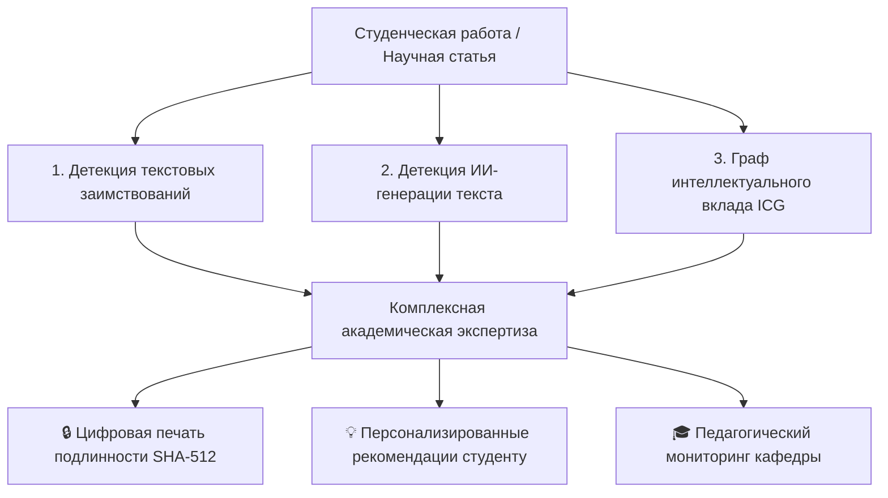
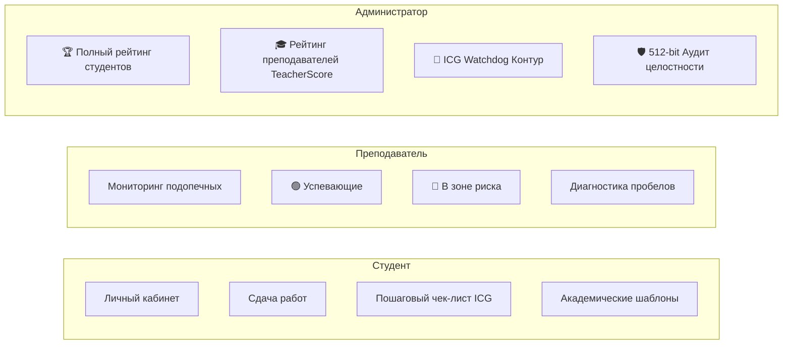

# 🎓 UniPlag & ICG v0.4.1 — Комплексный обзор проекта (Project Review)

> **Система комплексного анализа академической оригинальности, детекции генеративного ИИ и графовой верификации интеллектуального вклада (ICG) с суверенной 512-битной защитой целостности.**

---

## 📌 1. Назначение и концепция системы

**UniPlag & ICG** — университетская платформа нового поколения для комплексной академической экспертизы выпускных квалификационных работ (ВКР), магистерских и кандидатских диссертаций, научных статей, курсовых и рефератов.

В отличие от традиционных систем поиска заимствований, оценивающих лишь поверхностный шингловый плагиат, UniPlag реализует **трехмерную парадигму проверки**:



---

## 🏛️ 2. Три столпа анализа UniPlag

### 1. Детекция заимствований (Plagiarism Detection Engine)
* **Алгоритм**: $N$-граммное шинглирование (W-shingling) с адаптивным окном, расчет коэффициента Жаккара и инвертированный индекс.
* **Источники**: Внутренний корпус университетских работ + локальный веб-архив страниц.
* **Результат**: Процент заимствований, пофрагментная карта совпадений со ссылками на первоисточники.

### 2. Детекция текста нейросетей (AI Text Detection Ensemble)
* **Алгоритм**: Мультимодельный ансамбль оценки перплексии, энтропии распределения $N$-грамм, стилометрических аномалий и трансформерных классификаторов (RuBERT / RuRoBERTa).
* **Результат**: Вероятность генерации ($0–100\%$) с выделением подозрительных предложений в тексте (желтая маркировка).

### 3. Граф интеллектуального вклада (Intellectual Contribution Graph — ICG v0.4.1)
* **Инновация**: Построение направленного ациклического графа (DAG) логических рассуждений текста.
* **Классификация узлов**:
  * ⚡ **Higher-Order Synthesis** — многоуровневый синтез независимых источников;
  * 🔗 **Novel Synthesis** — сопоставительный анализ данных;
  * 🌟 **Original Discovery / Hypothesis** — авторские выводы, эмпирические результаты;
  * 💡 **Inference** — логические следствия;
  * 📖 **Reproduction** — чистое реферативное воспроизведение;
  * ⚠️ **Unsupported / Contradictory** — необоснованные или противоречивые утверждения.
* **Метрика ICG ($0–100\%$)**: измеряет долю реальной исследовательской работы против компиляции чужих мыслей.

---

## 👥 3. Ролевая модель и аналитический функционал



### 3.1. Для Студента
* **Персональный академический рейтинг**: отображение ранга среди всех студентов вуза.
* **Интерактивный отчёт по работе ([`/report/{id}`](http://localhost:8000/report/1))**:
  * Скролл-окно чтения текста с плавной прокруткой, зумом (`A-`/`A+`), копированием и полноэкранным режимом.
  * Персонализированные рекомендации ICG: *Главный вектор роста, сильные стороны, 5 аспектов качества (синтез, выводы, доказательства, согласованность, стилометрия)*.
  * **Пошаговый чек-лист доработки** и **готовые академические фразы-шаблоны** для исправления реферативности.

### 3.2. Для Преподавателя
* **Мониторинг прикреплённых студентов**: автоматическое разделение на группы:
  * 🟢 **Успевающие (`performing`)**: $\ge 1$ работа, ICG $\ge 45\%$, оригинальность $\ge 65\%$, ИИ $< 40\%$.
  * 🔴 **В зоне риска (`at_risk`)**: 0 сданных работ, ICG $< 25\%$, плагиат $> 60\%$ или ИИ $> 60\%$.
  * 🟡 **Требуют внимания (`attention`)**: пограничные показатели.
* **Диагностические бейджи**: мгновенное указание причины риска (например, *«Критически низкий ICG (14%)»*).
* **Фильтрация в 1 клик**: карточки *Все студенты / Мои студенты / Успевающие / В зоне риска*.

### 3.3. Для Администратора и Кафедры
* **Полный студенческий рейтинг по лигам**: разделение на высшую, среднюю и зону риска с цветовыми полосами.
* **Рейтинг преподавателей (`compute_teacher_ratings`)**:
  $$\text{TeacherScore} = 0.4 \times \text{AvgICG} + 0.3 \times \text{AvgOrig} + 0.3 \times \text{SuccessRate}$$
  * Звания: 🥇 *Кафедральный лидер*, 🟢 *Эффективный руководитель*, 🟡 *Удовлетворительно*, 🔴 *Требует внимания*.
* **ICG Watchdog & Black-box Health Monitoring**:
  * Слепые тесты (Blind Benchmarks) и Red-team атаки на устойчивость метрики ICG против деградации.
  * Автоматический арбитраж деградации контура.

---

## 🛡️ 4. Криптографическая безопасность и защита кода (512-bit Sovereign Integrity)

Система оснащена встроенной подсистемой контроля неизменяемости и защиты исходного кода от несанкционированной подделки:

1. **512-битный мастер-ключ (`HMAC-SHA512`)**:
   * Хранится локально на доверенной машине разработчика в `.security/sovereign_512.key` (исключён из git).
2. **Блокчейн-подобный криптографический реестр (`.security/audit_ledger.json`)**:
   * Каждое утверждённое изменение исходного кода подписывается 512-битной подписью с записью автора, даты, хэшей файлов и цепочки предыдущих блоков.
   * При модификации любого файла без подписи система мгновенно детектирует расхождение консенсуса.
3. **Реестр доверенных разработчиков (`.security/trusted_nodes.json`)**:
   * Верификация аппаратных узлов и разработчиков (Machine ID, Hostname, Developer Certificate).

---

## 📂 5. Структура кодовой базы

```
uniplag/
├── app/
│   ├── icg/                        # Модуль графа интеллектуального вклада ICG v0.4.1
│   │   ├── graph_builder.py        # Построение DAG рассуждений, анкеров и синтеза
│   │   ├── recommendations.py      # Генератор педагогических рекомендаций и чек-листов
│   │   ├── icg_watchdog.py         # Монитор деградации и слепого тестирования
│   │   └── benchmarks/             # Эталонные датасеты и референсные графы
│   ├── checker.py                  # Фоновый пул асинхронной проверки документов
│   ├── config.py                   # Конфигурация порогов и путей
│   ├── db.py                       # Модели SQLAlchemy (User, Document, Check, Match, Fragment)
│   ├── integrity.py                # 512-битная криптографическая защита кода
│   ├── main.py                     # Маршруты FastAPI, дашборды, рейтинги
│   ├── parsing.py                  # Мультиформатный парсер (DOCX, DOC, PDF, RTF, TXT, ODT)
│   ├── plagiarism.py               # Движок шинглирования и поиска совпадений
│   ├── static/                     # CSS-стили, кастомные скроллбары, темы
│   └── templates/                  # Шаблоны Jinja2 (dashboard, report, upload, icg, consensus)
├── dist/
│   └── UniPlag_Server/             # Автономный исполняемый дистрибутив (.exe)
├── scripts/
│   ├── approve_changes.py          # Утилита подписания изменений 512-битным ключом
│   ├── build_exe.py                # PyInstaller-сборщик автономного сервера
│   ├── test_teacher_ranking.py     # Тесты рейтинга преподавателей и лиг студентов
│   ├── test_text_viewer.py         # Тесты окна чтения текста работы
│   ├── test_robust_parsing.py      # Тесты мультиформатного парсинга файлов
│   └── test_icg_recommendations.py # Тесты генератора рекомендаций ICG
├── run_server.py                   # Отказоустойчивый серверный лаунчер с логированием
├── run_server.bat                  # Пакетный файл запуска в 1 клик
└── PROJECT_REVIEW.md               # Данный обзор проекта
```

---

## 🧪 6. Результаты верификации и тестов

Все ключевые подсистемы покрыты автоматическими сьютами тестов:

| Тестовый сьют | Назначение | Результат |
|---|---|:---:|
| `test_teacher_ranking.py` | Расчёт `TeacherScore`, ранжирование кафедры, лиги студентов | **15/15 PASS (100%)** ✅ |
| `test_teacher_performance_tracking.py` | Классификация `performing` / `at_risk`, фильтры преподавателя | **20/20 PASS (100%)** ✅ |
| `test_icg_recommendations.py` | Педагогические вердикты, чек-листы, академические шаблоны | **16/16 PASS (100%)** ✅ |
| `test_text_viewer.py` | Скролл-окно, защита от пустых файлов, тулбар чтения | **10/10 PASS (100%)** ✅ |
| `test_robust_parsing.py` | Парсинг DOCX, DOC (Word 97), PDF, RTF, TXT, ODT | **6/6 PASS (100%)** ✅ |
| `test_server_launcher.py` | Логирование `server.log`/`error.log`, автоподбор портов 7932+ | **7/7 PASS (100%)** ✅ |

---

## 🚀 7. Руководство по запуску

### Вариант 1: Запуск через готовый EXE (без настройки окружения)
1. Запустите двойным кликом **`run_server.bat`** (или `dist\UniPlag_Server\UniPlag_Server.exe`).
2. Сервер автоматически запустится на **`http://localhost:7932/`** и откроет браузер.

### Вариант 2: Запуск через Python
```bash
# Активация виртуального окружения
.venv\Scripts\activate

# Запуск сервера на порту 7932
python run_server.py --port 7932
```

### Подписание новых изменений 512-битным мастер-ключом:
```bash
python scripts/approve_changes.py --author "Ваше Имя" --message "Описание доработки"
```
