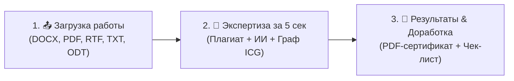

# 📖 Руководство пользователя платформы UniPlag & ICG v0.4.1

> **Официальное практическое руководство по работе с университетской платформой комплексного академического анализа, проверки оригинальности, детекции ИИ-текста и оценки графа интеллектуального вклада (ICG).**

---

## ⚡ Быстрый старт: Как работает платформа за 3 шага



1. **Загрузите файл**: Перейдите во вкладку **«Загрузка»** и выберите файл вашей ВКР, курсовой, статьи или реферата.
2. **Получите результат**: Система автоматически рассчитает оригинальность, процент вероятной генерации нейросетью и глубину авторского синтеза (ICG).
3. **Скачайте сертификат или доработайте работу**: В отчёте вы найдёте готовый **PDF-сертификат с цифровой печатью SHA-512** для сдачи в деканат/ГЭК и **пошаговый чек-лист** с академическими формулировками для улучшения работы.

---

## 🎓 1. Инструкция для СТУДЕНТА

### 1.1. Главная панель (Личный кабинет)
* Вверху отображаются ваши ключевые показатели: количество сданных работ, средняя оригинальность, средний ICG-вклад и **ваше текущее место в академическом рейтинге университета** (например, `#3 из 48`).
* В таблице «Мои проверенные работы» хранятся все ваши загруженные документы с прямыми ссылками на интерактивные отчёты.

### 1.2. Как сдать работу на проверку
1. Нажмите кнопку **«📤 Сдать новую работу»** (или вкладку **«Загрузка»** в шапке).
2. Перетащите файл в зону загрузки или нажмите «Выберите файл» (поддерживаются форматы: `.docx`, `.doc`, `.pdf`, `.rtf`, `.txt`, `.odt`).
3. Выберите режим проверки:
   * **🛡️ Полный анализ** *(рекомендуется)* — Плагиат + Детекция ИИ + Логический граф ICG.
   * **📄 Только плагиат** — быстрый поиск заимствований по университетскому корпусу.
   * **🤖 Только детекция ИИ** — проверка на генерацию текста через ChatGPT / нейросети.
4. Нажмите **«Начать проверку»**. Результаты будут готовы в течение 3–7 секунд!

### 1.3. Как читать показатели в отчёте ([`/report/{id}`](http://localhost:7932/report/1))

| Показатель | Норма | Что означает |
|---|:---:|---|
| **Оригинальность** | $\ge 70–80\%$ | Доля уникального авторского текста без совпадений с базой. |
| **Заимствования** | $< 20–30\%$ | Процент текста, совпавший с другими работами или веб-архивом. |
| **ИИ-генерация** | $< 20–30\%$ | Вероятность того, что фрагменты были сгенерированы нейросетью. |
| **Вклад ICG v0.4** | $\ge 45–70\%$ | **Степень научной зрелости**: глубина логического синтеза источников и наличие самостоятельных авторских выводов. |

### 1.4. Использование рекомендаций ICG и чек-листа доработки
В нижней части отчёта система формирует персонализированный план улучшения работы:
* **🎯 Главный вектор роста**: ключевой совет по усилению исследования.
* **📋 Пошаговый чек-лист доработки**: конкретные пункты (например, *«Добавьте сравнительный анализ в раздел 2»*, *«Усильте обоснование формулы (3)»*).
* **💡 Готовые академические шаблоны**: профессиональные фразы научного стиля (*«Сопоставительный анализ подходов X и Y позволяет выявить...»*).

### 1.5. Как скачать официальный PDF-сертификат
* В правом верхнем углу отчёта нажмите фиолетовую кнопку **`📄 Скачать PDF-сертификат`**.
* Будет сформирован официальный документ формата А4 с реквизитами вуза, результатами проверки, таблицей источников и **цифровой печатью подлинности SHA-512** для вклейки в пояснительную записку к диплому.

---

## 👨‍🏫 2. Инструкция для ПРЕПОДАВАТЕЛЯ

### 2.1. Мониторинг закреплённых студентов
* В панели управления преподавателю доступны 4 карточки-фильтра в 1 клик:
  * **`Все студенты`** — общий рейтинг потока.
  * **`👥 Мои студенты`** — список закреплённых за вами дипломников и курсовиков (отмечены бейджем *«Ваш студент»*).
  * **`🟢 Успевающие (Высокий ICG)`** — студенты с отличным авторским вкладом ($\ge 45\%$) и оригинальностью ($\ge 65\%$).
  * **`🔴 В зоне риска / Не успевают`** — студенты с 0 сданных работ к сроку, ICG $< 25\%$ (чистый реферат) или высоким плагиатом/ИИ.

### 2.2. Диагностика академических рисков
В таблице студентов система автоматически подсвечивает точную причину риска:
* ⚠️ *«0 сданных работ к установленному сроку»*;
* ⚠️ *«Критически низкий ICG вклад (14%) — реферативное изложение»*;
* ⚠️ *«Высокая генерация ИИ (72%)»*.

### 2.3. Педагогический рейтинг кафедры (`TeacherScore`)
* Во вкладке **«🎓 Рейтинг преподавателей»** рассчитывается сводный индекс педагогической эффективности:
  $$\text{TeacherScore} = 0.4 \times \text{AvgICG} + 0.3 \times \text{AvgOrig} + 0.3 \times \text{SuccessRate}$$
* Кафедра видит долю успешных подопечных, средний ICG их работ и перечень лучших студентов каждого руководителя.

---

## 👑 3. Инструкция для АДМИНИСТРАТОРА

### 3.1. Управление пользователями и закрепление студентов ([`/admin/users`](http://localhost:7932/admin/users))
* Добавление студентов, преподавателей и администраторов.
* Указание учебной группы (например, `ИВТ-41`, `ПИ-32`).
* Назначение научного руководителя / преподавателя для каждого студента.

### 3.2. Пополнение корпуса через научные базы ([`/corpus/search_science`](http://localhost:7932/corpus/search_science))
* Поиск по открытому API **arXiv** и научным репозиториям по теме исследования.
* Импорт статей в корпус проверок в 1 клик через кнопку **`+ В корпус проверок`**.
* Добавление произвольных веб-страниц по URL в локальный архив.

### 3.3. Мониторинг деградации ICG Watchdog ([`/admin/icg`](http://localhost:7932/admin/icg))
* Контроль точности алгоритма ICG по **22 слепым эталонным графам** ($\ge 19/22$) и **30 Red-team стресс-тестам** ($\ge 17/30$).
* Запуск ручной или автоматической фоновой калибровки.

### 3.4. 512-битный криптографический аудит целостности ([`/admin/consensus`](http://localhost:7932/admin/consensus))
* Просмотр цепочки блоков неизменяемости исходного кода (`audit_ledger.json`).
* Подписание новых доработок локальным мастер-ключом HMAC-SHA512 через:
  ```bash
  python scripts/approve_changes.py --author "Имя Разработчика" --message "Описание изменений"
  ```

---

## ❓ 4. Часто задаваемые вопросы (FAQ)

**В: На каком порту работает сервер?**  
О: По умолчанию сервер запускается на порту **`7932`** (`http://localhost:7932/`). Если порт занят другим процессом, лаунчер автоматически выберет следующий свободный порт (`7933` и т.д.).

**В: Как запустить сервер на Windows?**  
О: Просто запустите двойным кликом файл **`run_server.bat`** (или `dist\UniPlag_Server\UniPlag_Server.exe`).

**В: Считается ли цитирование за плагиат?**  
О: Корректно оформленные цитаты с указанием источника распознаются алгоритмом ICG как опорные анкерные узлы (`Anchors`), что повышает балл синтеза, а не снижает оценку.

**В: Нужна ли Ollama для работы детектора ИИ?**  
О: Для максимальной точности глубокого смыслового анализа текста нейросетей рекомендуется установить **[Ollama](https://ollama.com)** (`ollama serve`). При запуске UniPlag автоматически определяет сервис и самостоятельно подгружает оптимальную легковесную модель (`qwen2.5:1.5b` / `llama3.2` / `gemma4`), в том числе в демо-режиме и контейнере BlackBox. Если Ollama не запущена, система автоматически задействует встроенный быстрый ML-ансамбль стилометрического анализа.

**В: Что делать, если ICG балл низкий при высокой оригинальности?**  
О: Это означает, что текст написан своими словами, но представляет собой пересказ без авторского анализа. Используйте блок «Рекомендации ICG» в отчёте: сопоставьте выводы разных авторов и сформулируйте собственное заключение.
