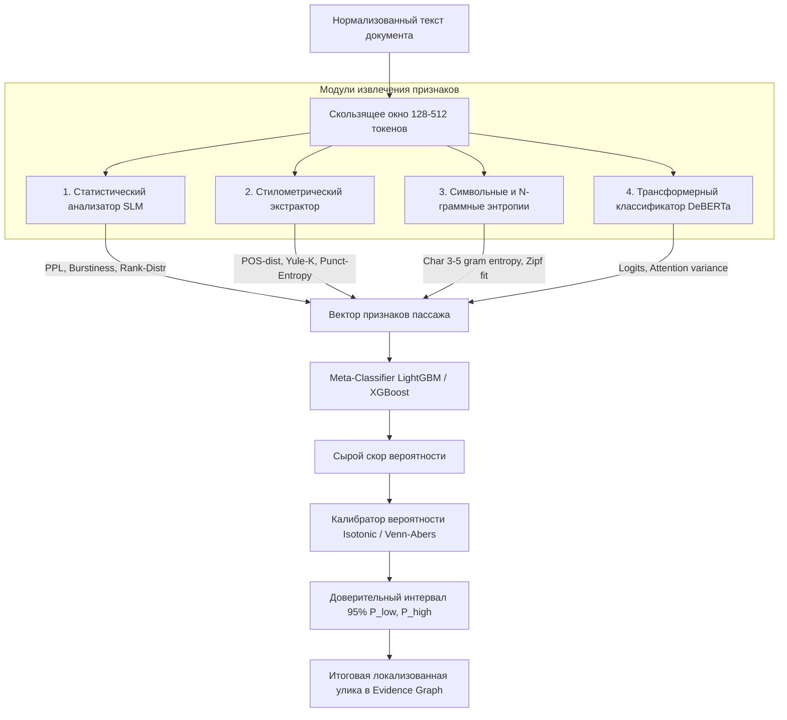
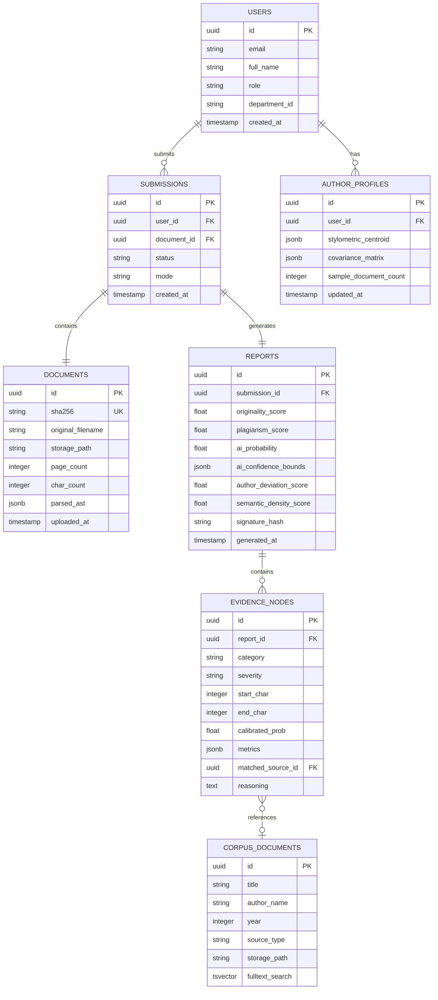
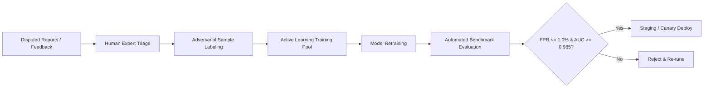
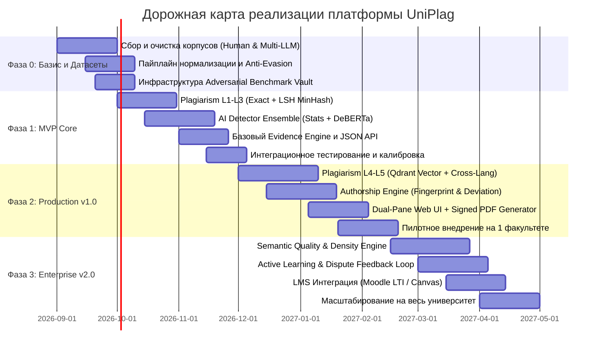

# ТЕХНИЧЕСКОЕ ЗАДАНИЕ (SOFTWARE REQUIREMENTS & ENGINEERING SPECIFICATION)
## Платформа комплексного анализа академической целостности «UniPlag»

* **Кодовое название проекта:** UniPlag (Universal Plagiarism, AI & Authorship Integrity Engine)
* **Версия документа:** 1.0.0-PROD-SPEC
* **Статус:** Нормативный инженерный документ (Baseline Engineering Specification)
* **Целевая среда развертывания:** On-Premise / Private Cloud (Air-Gapped Ready)

---

## 1. НАЗНАЧЕНИЕ СИСТЕМЫ

Система **UniPlag** — модульная высоконагруженная программная платформа доказательного анализа академической честности текстов. Система предназначена для всестороннего анализа квалификационных, научных и учебных работ (курсовые, дипломные работы, диссертации, научные статьи, эссе).

В отличие от классических систем проверки оригинальности и "чёрных ящиков" ИИ-детекции, UniPlag реализует концепцию **Evidence-Based Integrity Assessment (Доказательный аудит)**:
1. Система не выносит однозначный вердикт в стиле "Текст сгенерирован ИИ на 87%", а формирует многофакторный структурированный граф доказательств (*Evidence Graph*).
2. Детекция ИИ отделена от доказательства авторства: вычисляется степень статистической аномальности и стилометрического отклонения от исторического профиля автора.
3. Поиск заимствований работает на 5 уровнях: от посимвольного совпадения до кросс-языкового семантического переноса.
4. Оценивается семантическое качество и плотность информации, исключая ложную валидацию бессодержательных, но грамматически гладких сгенерированных текстов.

```
                    ┌──────────────────────────────────────────────────┐
                    │               DOCUMENT INGESTION                 │
                    │         PDF / DOCX / ODT / TXT / URLs            │
                    └────────────────────────┬─────────────────────────┘
                                             │
                                             ▼
                    ┌──────────────────────────────────────────────────┐
                    │       EXTRACTION & ANTI-EVASION PIPELINE         │
                    │  Unicode Normalization / OCR / AST Tokenization │
                    └────────────────────────┬─────────────────────────┘
                                             │
        ┌───────────────────┬────────────────┼───────────────────┬───────────────────┐
        ▼                   ▼                ▼                   ▼                   ▼
┌──────────────┐    ┌──────────────┐ ┌──────────────┐    ┌──────────────┐    ┌──────────────┐
│  PLAGIARISM  │    │ AI DETECTION │ │  AUTHORSHIP  │    │   SEMANTIC   │    │ REWRITING &  │
│    ENGINE    │    │   ENSEMBLE   │ │ FINGERPRINT  │    │   DENSITY    │    │ TRANSLATION  │
│ (L1-L5 Match)│    │ (Stats+ML+NN)│ │ (Deviation)  │    │  (Fact/Logic)│    │ (Adversarial)│
└───────┬──────┘    └──────┬───────┘ └──────┬───────┘    └──────┬───────┘    └──────┬───────┘
        │                  │                │                   │                   │
        └──────────────────┴────────────────┼───────────────────┴───────────────────┘
                                            ▼
                    ┌──────────────────────────────────────────────────┐
                    │             EVIDENCE GRAPH ENGINE                │
                    │  Span Attribution / Calibration / Uncertainty    │
                    └───────────────────────┬──────────────────────────┘
                                            │
                                            ▼
                    ┌──────────────────────────────────────────────────┐
                    │        REPORT GENERATOR & VERIFIED AUDIT         │
                    │  Interactive UI / Signed PDF / Exportable REST   │
                    └──────────────────────────────────────────────────┘
```

---

## 2. ЦЕЛИ СИСТЕМЫ

1. **Многоуровневое выявление заимствований (Plagiarism Detection):**
   * Обнаружение дословных совпадений, перестановок, синонимических замен, структурных перефразирований и кросс-языкового плагиата (RU $\leftrightarrow$ EN $\leftrightarrow$ KZ/BY/UA).
2. **Верифицируемая детекция генеративного текста (AI Detection):**
   * Ансамблевая оценка вероятности генерации LLM с локализацией до конкретного предложения и абзаца.
   * Строгий контроль вероятности ложноположительных срабатываний ($\text{FPR} < 1.0\%$ на академических текстах).
3. **Идентификация и профилирование авторского стиля (Authorship Verification):**
   * Сравнение текущей работы со стилометрическим вектором (*Writing Fingerprint*) предыдущих работ конкретного автора.
4. **Анализ содержательного качества (Semantic Quality):**
   * Разделение внешнего стилистического лоска и реальной фактологической плотности. Обнаружение "воды", циклической тавтологии и псевдонаучного шума.
5. **Абсолютная воспроизводимость и доказательность:**
   * Каждое подсвеченное срабатывание привязано к конкретному математическому признаку, индексу заимствованного источника или статистическому выбросу.

---

## 3. NON-GOALS (ЧТО СИСТЕМА НЕ ДЕЛАЕТ)

1. **Автоматическое выставление карательных оценок / отчисление:** Система является инструментом поддержки принятия решений преподавателем/экспертом (Human-in-the-Loop) и не заменяет экспертную комиссию.
2. **Проверка орфографии и пунктуации в стиле Grammarly:** Задача системы — целостность и подлинность, а не редактирование рукописи.
3. **Заявление о 100% философской детекции ИИ:** Система оценивает статистическое сходство с распределением вероятностей языковых моделей и стилометрические аномалии, открыто отображая интервал неопределенности (Conformal Prediction intervals).

---

## 4. ТЕРМИНОЛОГИЯ И МАТЕМАТИЧЕСКИЙ АППАРАТ

* **Shingle ($k$-шингал):** Подпоследовательность из $k$ последовательных токенов нормализованного текста.
* **MinHash:** Функция хеширования для быстрой аппроксимации коэффициента Жаккара $J(A,B) = \frac{|A \cap B|}{|A \cup B|}$ между множествами шинглов:
  $$\hat{J}(A,B) = \frac{1}{m} \sum_{i=1}^m \mathbb{I}(\min(h_i(A)) = \min(h_i(B)))$$
* **LSH (Locality-Sensitive Hashing):** Разделение $m$ MinHash-хешей на $b$ полос по $r$ строк ($m = b \cdot r$) для поиска кандидатов за $O(1)$. Вероятность попадания в одну корзину: $P = 1 - (1 - s^r)^b$, где $s$ — сходство Жаккара.
* **Perplexity ($PPL$):** Мера неожиданности текста для эталонной языковой модели $M$:
  $$PPL(W) = \exp\left(-\frac{1}{N} \sum_{i=1}^N \ln P_M(w_i \mid w_1, \dots, w_{i-1})\right)$$
* **Burstiness ($B$):** Вариативность длины и перплексии предложений в тексте:
  $$B = \frac{\sigma_{PPL} - \mu_{PPL}}{\sigma_{PPL} + \mu_{PPL}}$$
  Человеческий текст обладает высоким $B$ (чередование коротких и сложных длинных конструкций); текст LLM монотонен ($B \to 0$).
* **Cross-Encoder Similarity:** Семантическая оценка схожести пары предложений $(S_1, S_2)$ через сквозной Transformer: $\text{Score} = \sigma(W \cdot \text{BERT}(S_1, S_2))$.
* **Expected Calibration Error ($ECE$):** Взвешенная разница между предсказанной уверенностью и фактической точностью:
  $$ECE = \sum_{m=1}^M \frac{|B_m|}{N} \left| \text{acc}(B_m) - \text{conf}(B_m) \right|$$

---

## 5. РОЛЕВАЯ МОДЕЛЬ (RBAC)

| Роль | Назначение | Доступ к данным | Права в системе |
|---|---|---|---|
| **Student** | Студент / Автор | Только собственные загруженные работы и открытые рецензии | Загрузка черновиков, самопроверка (с лимитом), просмотр отчёта |
| **Instructor** | Преподаватель / Рецензент | Работы прикрепленных групп и курсов | Запуск проверки, просмотр полного графа улик, комментирование |
| **Department Admin** | Зав. кафедрой / Деканат | Все работы факультета/кафедры, статистика | Аудит проверок, разрешение апелляций, выгрузка сводных отчётов |
| **System Admin / MLOps** | Системный инженер | Инфраструктура, конфигурации, журналы | Управление весами моделей, калибровка, переобучение, импорт корпусов |
| **Auditor / API Service** | Внешняя ИС (LMS Moodle) | Машинный доступ по токенам через API | Пакетная загрузка, асинхронный поллинг результатов |

---

## 6. КАРТА ПОЛЬЗОВАТЕЛЬСКИХ СЦЕНАРИЕВ (USE CASES)

```mermaid
flowchart TD
    subgraph UC_Student[Сценарий Студента]
        S1[Загрузка черновика работы] --> S2[Пре-чек: выявление случайных нецитированных фрагментов]
        S2 --> S3[Корректировка оформления цитирований]
    end

    subgraph UC_Instructor[Сценарий Преподавателя]
        I1[Пакетный приём работ группы] --> I2[Автоматический триаж по порогам риска]
        I2 --> I3{Риск высокий?}
        I3 -- Да --> I4[Детальный аудит Evidence Graph]
        I3 -- Нет --> I5[Экспресс-утверждение]
        I4 --> I6[Формирование протокола с цитированием улик]
    end

    subgraph UC_Admin[Сценарий Анализа Авторства]
        A1[Спорный случай / Апелляция] --> A2[Подключение исторического корпуса автора]
        A2 --> A3[Сравнение стилометрического профиля]
        A3 --> A4[Заключение о девиации авторского стиля]
    end
```



---

## 7. РЕЕСТР ТРЕБОВАНИЙ (REQUIREMENTS TRACEABILITY MATRIX)

### Категории идентификаторов:
* `INGEST-*` — Приём, извлечение и нормализация документов
* `PLG-*` — Движок поиска заимствований (Plagiarism Engine)
* `AI-DET-*` — Движок детекции ИИ (AI Detection Engine)
* `AUTH-*` — Движок анализа авторского профиля (Authorship Engine)
* `SEM-*` — Движок семантического качества (Semantic Quality Engine)
* `EVID-*` — Движок улик и трассировки (Evidence Engine)
* `API-*` — Интерфейсы интеграции
* `SEC-*` — Безопасность и приватность
* `PERF-*` — Производительность и масштабируемость
* `MLOPS-*` — Управление моделями, датасетами и бенчмарками

| ID | Категория | Формулировка требования | Приоритет |
|---|---|---|---|
| **INGEST-001** | Ingestion | Извлечение текста из форматов PDF, DOCX, DOC, ODT, RTF, TXT, HTML с сохранением метаданных структуры (заголовки, абзацы, сноски, списки литературы). | P0 (Must) |
| **INGEST-002** | Normalization | Посимвольная нормализация Unicode (NFKC), удаление невидимых символов (Zero-width space, soft hyphens), выявление и замена латинско-кириллического гомоглифного спуфинга. | P0 (Must) |
| **INGEST-003** | Segmentation | Структурная сегментация документа: разделение на титульный лист, оглавление, основной текст, блок формул, блок программного кода и список литературы. | P0 (Must) |
| **INGEST-004** | OCR Fallback | Автоматический запуск OCR для сканированных страниц и текстовых фрагментов, вставленных как растровые изображения (Tesseract/EasyOCR). | P1 (Should) |
| **PLG-001** | Plagiarism L1 | Посимвольное и пословное точное сопоставление подстрок длиной $\ge 30$ символов / $\ge 5$ слов с использованием суффиксных структур / прямых хеш-таблиц. | P0 (Must) |
| **PLG-002** | Plagiarism L2 | Лексический поиск кандидатов на базе 5-граммных шинглов с MinHash (256 хеш-функций) и LSH-индексацией по локальному университетскому корпусу. | P0 (Must) |
| **PLG-003** | Plagiarism L3 | Нечеткое выравнивание (Fuzzy Alignment / Smith-Waterman) для локализации фрагментов с перестановкой слов и синонимическими заменами. | P0 (Must) |
| **PLG-004** | Plagiarism L4 | Семантический векторный поиск заимствованных идей и парафразов с использованием мультиязычных плотных эмбеддингов (Dense Retrieval) и Cross-Encoder переранжирования. | P0 (Must) |
| **PLG-005** | Plagiarism L5 | Кросс-языковой поиск заимствований (RU $\leftrightarrow$ EN $\leftrightarrow$ KZ) через проекцию в общее семантическое векторное пространство без обязательного предварительного машинного перевода всего документа. | P1 (Should) |
| **PLG-006** | Bibliography | Автоматическое исключение корректно оформленных цитат и списка литературы из штрафного процента заимствований. | P0 (Must) |
| **AI-DET-001** | AI Stats | Расчёт скользящего окна перплексии ($PPL$), энтропии распределения токенов, коэффициента взрывности ($Burstiness$) и фрактальной размерности длины предложений на базе легковесной локальной SLM. | P0 (Must) |
| **AI-DET-002** | AI Stylometry | Извлечение расширенного вектора стилометрических признаков: распределение служебных слов, POS-n-граммы, глубина синтаксического дерева зависимостей, лексическое разнообразие (Yule's $K$, Simpson's $D$, MTLD). | P0 (Must) |
| **AI-DET-003** | AI Neural | Нейросетевая классификация на уровне предложений и фрагментов текста на базе дообученного трансформера (DeBERTa-v3 / RoBERTa architecture) с attention-картами. | P0 (Must) |
| **AI-DET-004** | AI Ensemble | Мета-классификатор (Gradient Boosting / Stacking) агрегирующий статистические, стилометрические и нейросетевые скоры в единую калиброванную вероятность. | P0 (Must) |
| **AI-DET-005** | AI Calibration | Обязательная вероятностная калибровка (Isotonic Regression / Venn-Abers) с валидацией $ECE \le 0.03$ и расчётом 95% конформного доверительного интервала $[P_{low}, P_{high}]$. | P0 (Must) |
| **AI-DET-006** | Multi-LLM Bench | Обязательная валидация детектора на сгенерированных текстах семейств: GPT-4o, Claude 3.5, Gemini 1.5/2.0, Llama 3, Qwen 2.5, Mistral, Gemma 2, DeepSeek с температурами от 0.1 до 1.2. | P0 (Must) |
| **AUTH-001** | Fingerprint | Построение инвариантного цифрового профиля автора (*Writing Fingerprint*) на основе $\ge 2$ подтверждённых исторических работ (длина предложений, пунктуационный профиль, частотные $n$-граммы, синтаксические шаблоны). | P1 (Should) |
| **AUTH-002** | Style Deviation | Расчёт меры статистического расстояния Махаланобиса и косинусного сдвига между текущей работой и историческим профилем автора с проверкой гипотезы о смене авторства. | P1 (Should) |
| **AUTH-003** | Intra-Doc Drift | Обнаружение внутридокументных аномалий стиля: выявление отдельных глав или разделов, резко выбивающихся из общего стиля остальной части документа. | P1 (Should) |
| **SEM-001** | Density Split | Раздельное вычисление индекса поверхностной стилистической связности ($S_{style}$) и индекса семантической плотности ($S_{density}$), предотвращающее выставление высоких оценок "водянистым" сгенерированным текстам. | P0 (Must) |
| **SEM-002** | Factual Density | Оценка фактологической насыщенности: плотность именованных сущностей (NER), численных показателей, терминов предметной области и проверяемых утверждений. | P1 (Should) |
| **SEM-003** | Logic & Coherence | Оценка связности дискурса через граф семантических переходов между смежными абзацами и выявление циклической тавтологии. | P1 (Should) |
| **EVID-001** | Provenance Tree | Построение дерева доказательств (Evidence DAG) для каждого сегмента документа: привязка каждого выделенного диапазона символов к источнику, математическому признаку или статистической аномалии. | P0 (Must) |
| **EVID-002** | Drill-Down UI | Обеспечение интерактивной детализации в UI: переход от общего интегрального показателя к конкретному предложению с раскрытием всех сработавших метрик. | P0 (Must) |
| **EVID-003** | Signed Report | Генерация криптографически подписанного PDF-протокола проверки с QR-кодом для верификации подлинности отчёта на сервере вуза. | P0 (Must) |
| **SEC-001** | On-Premise Air-Gap | Полная автономность работы: система должна функционировать в изолированном сетевом контуре университета без внешних вызовов к сторонним облачным API. | P0 (Must) |
| **SEC-002** | Anonymization | Поддержка режима "слепого рецензирования": автоматическое маскирование персональных данных студентов (ФИО, группа, кафедра) в отчётах. | P1 (Should) |
| **PERF-001** | Latency SLA | Время полной проверки стандартной студенческой работы (25 страниц, 50 000 знаков) не должно превышать 8 секунд в синхронном режиме и 3 секунд в пакетной очереди при наличии GPU. | P0 (Must) |
| **PERF-002** | Scalability | Горизонтальное масштабирование воркеров анализа (Celery/RQ) с поддержкой очереди до 50 000 документов в период пиковых сессионных нагрузок. | P0 (Must) |
| **MLOPS-001** | Benchmark Isolation | Гарантия изоляции Adversarial Benchmark датасета: тестовый корпус валидации шифруется и никогда не попадает в обучающую выборку моделей. | P0 (Must) |
| **MLOPS-002** | False Positive Gate | Автоматический блок деплоя новой версии модели, если $\text{FPR}$ на контрольном корпусе академических человеческих работ превышает $1.0\%$. | P0 (Must) |

---

## 8. АРХИТЕКТУРА ДВИЖКА ПЛАГИАТА (PLAGIARISM ENGINE)

Движок реализует 5-слойную воронку фильтрации (Cascade Matcher), сочетающую максимальную скорость грубого отсева с точностью глубокого семантического выравнивания.

```
       [ Загруженный документ ]
                  │
                  ▼
┌───────────────────────────────────┐
│ Layer 1: Exact Substring Matching │ ──► Прямые цитаты / дословные куски (Hash / Suffix Array)
└─────────────────┬─────────────────┘
                  │  (Остаток / Кандидаты)
                  ▼
┌───────────────────────────────────┐
│ Layer 2: Lexical N-Gram + MinHash │ ──► Шинглы 5-слов, LSH Index (OpenSearch / Inverted Index)
└─────────────────┬─────────────────┘
                  │  (Топ-K кандидатов документов)
                  ▼
┌───────────────────────────────────┐
│ Layer 3: Fuzzy & Token Alignment  │ ──► Smith-Waterman локальное выравнивание, Levenshtein
└─────────────────┬─────────────────┘
                  │  (Семантический анализ фрагментов)
                  ▼
┌───────────────────────────────────┐
│ Layer 4: Dense Semantic Retrieval │ ──► Embeddings (bge-m3 / e5-large) + Qdrant HNSW Vector Search
└─────────────────┬─────────────────┘
                  │  (Кросс-языковые пары)
                  ▼
┌───────────────────────────────────┐
│ Layer 5: Cross-Language Semantic  │ ──► Мультиязычная проекция RU ↔ EN ↔ KZ + Cross-Encoder
└─────────────────┬─────────────────┘
                  │
                  ▼
       [ Унифицированная маска заимствований ]
```

### Спецификация слоёв:

1. **Layer 1 (Exact):**
   * Токенизация без знаков препинания в нижнем регистре. Поиск точных подстрок от 30 символов через Rolling Hash (Rabin-Karp) по инвертированному индексу хешей блоков.
2. **Layer 2 (Lexical & LSH):**
   * Формирование 5-словных шинглов со скользящим окном.
   * Вычисление 256 MinHash-хешей с использованием семейств линейных хеш-функций $h_i(x) = (a_i x + b_i) \bmod p$.
   * LSH-индексация: 64 полосы по 4 строки. Поиск кандидатов в локальном корпусе вуза за миллисекунды.
3. **Layer 3 (Fuzzy Matcher):**
   * Модифицированный алгоритм Смита-Ватермана (Smith-Waterman) для локального выравнивания последовательностей токенов со штрафами за вставки (gap opening penalty) и пропуски (gap extension penalty).
   * Позволяет находить заимствования с переставленными словами, внедренными вводными словами и синонимами.
4. **Layer 4 (Semantic Vector Search):**
   * Разбиение документа на семантические пассажи (чанки по 256 токенов с перекрытием 64 токена).
   * Векторизация моделью `BAAI/bge-m3` или `intfloat/multilingual-e5-large`.
   * Поиск ближайших соседей (ANN) в векторной БД Qdrant (метрика: Cosine Similarity, индекс: HNSW с параметрами `m=16, ef_construct=128`).
   * Переранжирование кандидатов кросс-энкодером `bge-reranker-large` (порог сходства $\ge 0.78$).
5. **Layer 5 (Cross-Language Search):**
   * Использование общего мультиязычного векторного пространства. Текст на русском языке сопоставляется с англоязычным корпусом без этапа явного перевода через единые эмбеддинги.
   * Для найденных кандидатов выполняется пофразовое выравнивание с обратным сопоставлением ключевых терминов.

---

## 9. АРХИТЕКТУРА ДВИЖКА ДЕТЕКЦИИ ИИ (AI DETECTION ENGINE)

Детекция ИИ строится на ансамбле независимых математических и нейросетевых классификаторов, объединенных калиброванным мета-классификатором.



### Компоненты ансамбля:

1. **Статистический анализатор (SLM-based Information Metrics):**
   * На базе компактной локальной модели (например, `Qwen2.5-0.5B` или `Llama-3.2-1B`).
   * Метрики: Лог-вероятность каждого токена $\log P(w_t \mid w_{<t})$, медианная перплексия окна, дисперсия перплексии между окнами, GLTR-метрики (доля токенов в Top-10, Top-100, Top-1000 и Tail распределения).
2. **Стилометрический экстрактор:**
   * 184 признака: частоты служебных слов (союзы, предлоги, частицы), коэффициенты лексического разнообразия (TTR, Root TTR, Yule's Characteristic $K$, Simpson's Index $D$, Shannon Entropy), средняя длина слова, средняя длина предложения, распределение пунктуационных знаков на 1000 символов, синтаксическая глубина деревьев (spaCy / UDPipe).
3. **Нейросетевой классификатор (Neural Sequence Classifier):**
   * Архитектура `DeBERTa-v3-large` (или специализированная мультиязычная модель), дообученная с контрастивным лоссом на парах Human Academic vs Multi-LLM Generations.
   * Классификатор возвращает покарточные вероятности на уровне предложений.
4. **Калибровка и доверительные интервалы (Uncertainty Quantification):**
   * Вычисление некалиброванного скора $s \in [0, 1]$.
   * Применение изотонической регрессии, обученной на отложенной калибровочной выборке.
   * Конформное предсказание (Conformal Prediction): формирование интервала $[P_{low}, P_{high}]$, гарантирующего заданный уровень покрытия $1 - \alpha = 0.95$. Если интервал широкий (например, $[0.20, 0.85]$), система помечает вердикт статусом *High Uncertainty / Insufficient Evidence*.

---

## 10. АРХИТЕКТУРА ДВИЖКА АВТОРСКОГО ПРОФИЛЯ (AUTHORSHIP ENGINE)

Движок решает задачу верификации авторства (*Authorship Verification 1:1* и *Outlier Detection*), фиксируя аномальные отклонения в стиле, если студент внезапно предоставил текст, радикально отличающийся от его предыдущих курсовых и контрольных работ.

```
┌───────────────────────────────────┐
│   Корпус предыдущих работ автора   │
│       (Doc 1, Doc 2, Doc 3)       │
└─────────────────┬─────────────────┘
                  │
                  ▼
┌───────────────────────────────────┐
│    Экстрактор стилометрии         │ ──► Векторы признаков {v_1, v_2, ..., v_k}
└─────────────────┬─────────────────┘
                  │
                  ▼
┌───────────────────────────────────┐
│   Writing Fingerprint Profile     │ ──► Базовый центроид μ_A и ковариационная матрица Σ_A
└─────────────────┬─────────────────┘
                  │
                  │       ┌───────────────────────────────────┐
                  │       │     Текущая проверяемая работа    │
                  │       └─────────────────┬─────────────────┘
                  │                         │
                  ▼                         ▼
┌───────────────────────────────────────────────────┐
│       Вычисление расстояния Махаланобиса          │
│       D_M(x) = sqrt( (x - μ_A)^T Σ_A^-1 (x - μ_A) )│
└─────────────────────────┬─────────────────────────┘
                          │
                          ▼
┌───────────────────────────────────────────────────┐
│    Статистический критерий проверки гипотезы      │
│    (F-test / Hotelling's T^2 p-value < 0.01)      │
└─────────────────────────┬─────────────────────────┘
                          │
                          ▼
       [ Вердикт: Аномальное отклонение от авторского профиля ]
```

### Контролируемые стилометрические инварианты:
* Длина предложений и распределение пауз (квантили 25%, 50%, 75%, 90%).
* Специфический словарь переходных конструкций ("таким образом", "следует отметить", "следовательно").
* Отношение гапаксов (Hapax Legomena — слова, встретившиеся один раз) к общему словарю.
* Частотный спектр биграмм частей речи (например, `ADJ + NOUN`, `PRON + VERB`).
* Внутридокументная дисперсия стиля: выявление вставок чужого текста внутри работы (*Intra-document Style Inconsistency*).

---

## 11. ДВИЖОК СЕМАНТИЧЕСКОГО КАЧЕСТВА И ПЛОТНОСТИ (SEMANTIC QUALITY ENGINE)

Решает критическую проблему современных LLM: генерация гладкого, грамматически безупречного, но абсолютно пустого или бессмысленного текста ("галлюцинации" и "наукообразная вода").

### Метрики качества:

1. **Индекс семантической плотности (Semantic Information Density):**
   $$I_{density} = \frac{N_{entities} + N_{facts} + N_{formulas}}{N_{total\_words}} \times \left(1 - \frac{N_{cliches}}{N_{sentences}}\right)$$
   * $N_{entities}$ — именованные сущности и термины предметной области.
   * $N_{facts}$ — количественные утверждения, даты, соотношения.
   * $N_{cliches}$ — шаблонные бессодержательные фразы ("в современном мире ни для кого не секрет, что развитие технологий играет важную роль").
2. **Индекс логической связности и дискурса (Discourse Coherence):**
   * Построение семантического графа связности между смежными абзацами.
   * Вычисление косинусного сходства между эмбеддингами соседних блоков текста: падение сходства ниже порога указывает на логический разрыв, а тождественное равенство ($\approx 1.0$) — на смысловое топтание на месте (циклическую тавтологию).
3. **Верификация цитирований и утверждений (Claim-Citation Binding):**
   * Парсинг ссылок на литературу вида `[1]`, `(Иванов, 2023)`.
   * Сопоставление тезиса в тексте с аннотацией и названием источника в списке литературы через NLI (Natural Language Inference: Entailment / Neutral / Contradiction).
   * Выявление сфабрикованных ("галлюцинированных") источников.

---

## 12. ДВИЖОК УЛИК И ТРАССИРОВКИ (EVIDENCE GRAPH ENGINE)

Каждое срабатывание в системе UniPlag представляет собой строго типизированный объект улики (*Evidence Node*), входящий в общий направленный ациклический граф доказательств (*Evidence DAG*).

### JSON-схема объекта улики (Evidence Node Schema):

```json
{
  "$schema": "https://json-schema.org/draft/2020-12/schema",
  "title": "EvidenceNode",
  "type": "object",
  "properties": {
    "evidence_id": { "type": "string", "format": "uuid" },
    "document_id": { "type": "string", "format": "uuid" },
    "category": {
      "type": "string",
      "enum": ["PLAGIARISM_EXACT", "PLAGIARISM_PARAPHRASE", "PLAGIARISM_CROSS_LANG", "AI_GENERATED", "AUTHOR_DEVIATION", "SEMANTIC_ANOMALY"]
    },
    "severity": { "type": "string", "enum": ["INFO", "LOW", "MEDIUM", "HIGH", "CRITICAL"] },
    "span": {
      "type": "object",
      "properties": {
        "start_char": { "type": "integer" },
        "end_char": { "type": "integer" },
        "start_sentence": { "type": "integer" },
        "end_sentence": { "type": "integer" },
        "raw_text": { "type": "string" }
      },
      "required": ["start_char", "end_char", "raw_text"]
    },
    "metrics": {
      "type": "object",
      "properties": {
        "calibrated_probability": { "type": "number", "minimum": 0.0, "maximum": 1.0 },
        "confidence_interval": {
          "type": "array",
          "items": { "type": "number" },
          "minItems": 2,
          "maxItems": 2
        },
        "perplexity": { "type": "number" },
        "burstiness": { "type": "number" },
        "stylometric_z_score": { "type": "number" },
        "semantic_similarity": { "type": "number" }
      },
      "required": ["calibrated_probability"]
    },
    "source_attribution": {
      "type": "object",
      "properties": {
        "source_id": { "type": "string" },
        "source_title": { "type": "string" },
        "source_url": { "type": "string" },
        "source_matched_span": { "type": "string" },
        "match_type": { "type": "string", "enum": ["EXACT", "SYNONYM_REORDER", "SEMANTIC_EMBEDDING", "TRANSLATION"] }
      }
    },
    "reasoning_explanation": { "type": "string" }
  },
  "required": ["evidence_id", "category", "severity", "span", "metrics", "reasoning_explanation"]
}
```

---

## 13. КОНВЕЙЕР ОБРАБОТКИ И НОРМАЛИЗАЦИИ ДОКУМЕНТОВ

```
[ Входной файл: PDF / DOCX / TXT / Scan ]
                   │
                   ▼
┌──────────────────────────────────────┐
│ 1. Извлечение структуры и разметки   │ ──► PyMuPDF / python-docx / Tika
└──────────────────┬───────────────────┘
                   │
                   ▼
┌──────────────────────────────────────┐
│ 2. Очистка и Anti-Evasion фильтры    │ ──► Удаление zero-width, soft hyphens
└──────────────────┬───────────────────┘
                   │
                   ▼
┌──────────────────────────────────────┐
│ 3. Нормализация Unicode и гомоглифов │ ──► NFKC + Latin-Cyrillic canonical mapping
└──────────────────┬───────────────────┘
                   │
                   ▼
┌──────────────────────────────────────┐
│ 4. Структурная сегментация (AST)     │ ──► Выделение цитат, формул, кода, библиографии
└──────────────────┬───────────────────┘
                   │
                   ▼
┌──────────────────────────────────────┐
│ 5. Токенизация и разбиение на чанки  │ ──► Предложения, 5-словные шинглы, эмбеддинг-пассажи
└──────────────────────────────────────┘
```

### Защита от техник обхода (Anti-Evasion Engine):
1. **Гомоглифная подмена (Cyrillic/Latin Confusables):** Приведение визуально идентичных глифов к канонической кодовой таблице (например, замена латинской `a` (U+0061) на кириллическую `а` (U+0430) в контексте русскоязычных слов). Фиксация факта попытки обхода как отдельной критической улики `EVASION_HOMOGLYPH`.
2. **Микроскопический и невидимый текст:** Обнаружение текста с размером шрифта $\le 1\,\text{pt}$, текста с цветом шрифта, совпадающим с цветом фона, или текста, вынесенного за границы видимой области страницы PDF.
3. **Скрытые спецсимволы:** Стриппинг Zero-Width Space (U+200B), Zero-Width Non-Joiner (U+200C), Zero-Width Joiner (U+200D), Word Joiner (U+2060) и RTL-маркеров спуфинга направления текста.

---

## 14. МУЛЬТИЯЗЫЧНАЯ АРХИТЕКТУРА (MULTILINGUAL SUPPORT)

* **Языковое покрытие:**
  * Русский (RU) — полная поддержка (морфология pymorphy3/spaCy-ru, стилометрия, эмбеддинги).
  * Английский (EN) — полная поддержка (NLTK, spaCy-en, DeBERTa, стилометрия).
  * Казахский (KZ), Белорусский (BY), Украинский (UA) — поддержка на уровне мультиязычных эмбеддингов, токенизации и поиска заимствований.
* **Автоматическая детекция языковых зон:**
  * Поабзацное определение языка на базе fastText / Lingua.
  * Корректная обработка двуязычных работ (например, диссертация на русском языке с резюме и вставками терминологии на английском).

---

## 15. АРХИТЕКТУРА ДАТАСЕТОВ И ОБУЧЕНИЯ

```
                     ┌────────────────────────────────────────┐
                     │          MASTER DATA REPOSITORY        │
                     └───────────────────┬────────────────────┘
                                         │
                 ┌───────────────────────┴───────────────────────┐
                 │                                               │
                 ▼                                               ▼
┌─────────────────────────────────┐             ┌─────────────────────────────────┐
│     TRAIN / VAL SPLIT (85%)     │             │ ADVERSARIAL BENCHMARK (15%)     │
│   (Доступен для обучения)       │             │ (STRICT AIR-GAP / READ ONLY)    │
└────────────────┬────────────────┘             └────────────────┬────────────────┘
                 │                                               │
                 ├───────────────────────────────┐               │
                 ▼                               ▼               ▼
┌─────────────────────────────────┐ ┌─────────────────────────┐ ┌─────────────────┐
│ Human Academic Corpus           │ │ Synthetic Multi-LLM     │ │ Red-Teaming     │
│ - Курсовые / ВКР (2010-2021)   │ │ - 50+ LLMs              │ │ Attacks Suite   │
│ - Научные статьи ВАК/РИНЦ/arXiv │ │ - 10+ Prompt Styles     │ │ (QuillBot, etc.)│
│ - Студенческие эссе            │ │ - Temp: 0.1 - 1.2       │ │                 │
└─────────────────────────────────┘ └─────────────────────────┘ └─────────────────┘
```

* **Правило нулевого заражения (Zero Data Contamination Rule):** Датасеты Adversarial Benchmark изолированы, хранятся в зашифрованном виде, и их хеши проверяются в CI/CD. Модели никогда не обучаются на контрольном бенчмарке.

---

## 16. КОНВЕЙЕР ОБУЧЕНИЯ МОДЕЛЕЙ (TRAINING PIPELINE)

1. **Фаза 1 (Эмбеддинги):** Дообучение модели мультиязычных представлений на парах академических парафразов с использованием Multiple Negatives Ranking Loss (MNRL).
2. **Фаза 2 (Трансформерная детекция):** Fine-tuning трансформера `DeBERTa-v3` на классификацию человеческих и сгенерированных пассажей с аугментацией данных (замена синонимов, симуляция опечаток, обрезка контекста).
3. **Фаза 3 (Мета-ансамбль):** Обучение LightGBM классификатора на 10-фолдовой кросс-валидации с оптимизацией гиперпараметров по Optuna.
4. **Фаза 4 (Калибровка):** Обучение изотонической регрессии на отложенной калибровочной выборке с контролем $ECE \le 0.03$.

---

## 17. МЕТРИКИ И КОНВЕЙЕР ОЦЕНКИ КАЧЕСТВА (EVALUATION PIPELINE)

Каждый релиз модели проходит автоматизированный конвейер тестирования со следующими порогами качества:

| Метрика | Минимально допустимое значение | Критическое значение (Gate Fail) |
|---|---|---|
| **ROC-AUC** | $\ge 0.985$ | $< 0.970$ |
| **PR-AUC** | $\ge 0.980$ | $< 0.960$ |
| **FPR на человеческих статьях** | $\le 0.008$ ($0.8\%$) | $> 0.010$ ($1.0\%$) |
| **FPR на работах не-носителей (ESL)** | $\le 0.015$ ($1.5\%$) | $> 0.020$ ($2.0\%$) |
| **Expected Calibration Error ($ECE$)** | $\le 0.030$ | $> 0.050$ |
| **Brier Score** | $\le 0.045$ | $> 0.060$ |
| **Plagiarism Top-1 Recall (L1-L3)** | $\ge 0.990$ | $< 0.975$ |
| **Paraphrase Detection F1 (L4)** | $\ge 0.890$ | $< 0.850$ |

---

## 18. АДВЕРСАРИАЛЬНЫЙ БЕНЧМАРК (RED TEAMING SUITE)

Набор стресс-тестов включает проверку устойчивости к следующим атакам:

1. **Humanizer & Paraphraser Attack:** Прогон сгенерированного текста через инструменты QuillBot, Undetectable AI, BypassGPT, HideMyAI.
2. **Multi-Hop Translation Attack:** Перевод `RU -> DE -> ZH -> RU` с последующей легкой правкой.
3. **Prompt Injection & Stylistic Masking:** Генерация с промптами вида: *"Напиши дипломный раздел с намеренными негрубыми стилистическими шероховатостями, характерными для студента 4 курса"*.
4. **Mixed Insertion Attack:** Чередование человеческих абзацев со сгенерированными абзацами (проверка точности локализации границ вставок).
5. **Academic Complexification Attack:** Намеренное насыщение сгенерированного текста редкими терминами и сложными деепричастными оборотами.

---

## 19. СПЕЦИФИКАЦИЯ ИНТЕРФЕЙСОВ (API SPECIFICATION)

### REST API Endpoints:

#### 1. Запуск комплексной проверки документа
`POST /api/v1/checks`
```json
// Request Body
{
  "document_url": "s3://uniplag-vault/docs/diploma_2026.pdf",
  "author_id": "usr_948194",
  "mode": "FULL_AUDIT",
  "options": {
    "enable_authorship_comparison": true,
    "enable_cross_language": true,
    "enable_semantic_quality": true
  },
  "callback_webhook": "https://lms.university.edu/api/webhooks/uniplag"
}

// Response (202 Accepted)
{
  "task_id": "tsk_84920481-4819-4812",
  "status": "QUEUED",
  "estimated_time_seconds": 6.5,
  "status_url": "/api/v1/tasks/tsk_84920481-4819-4812"
}
```

#### 2. Получение статуса задачи
`GET /api/v1/tasks/{task_id}`
```json
{
  "task_id": "tsk_84920481-4819-4812",
  "status": "COMPLETED",
  "progress_percent": 100,
  "report_id": "rep_39105820"
}
```

#### 3. Получение структурированного отчёта
`GET /api/v1/reports/{report_id}`
```json
{
  "report_id": "rep_39105820",
  "document_metadata": {
    "filename": "diploma_2026.pdf",
    "pages": 48,
    "character_count": 84210,
    "word_count": 11200,
    "sha256": "e3b0c44298fc1c149afbf4c8996fb92427ae41e4649b934ca495991b7852b855"
  },
  "summary": {
    "originality_score": 0.842,
    "plagiarism_score": 0.158,
    "ai_generated_probability": 0.124,
    "ai_confidence_interval": [0.08, 0.18],
    "author_deviation_score": 0.05,
    "semantic_density_score": 0.78,
    "status": "APPROVED"
  },
  "evidences": [
    {
      "evidence_id": "ev_001",
      "category": "PLAGIARISM_EXACT",
      "severity": "HIGH",
      "span": {
        "start_char": 1420,
        "end_char": 2100,
        "start_sentence": 14,
        "end_sentence": 19,
        "raw_text": "Таким образом, архитектура распределённых реестров..."
      },
      "metrics": {
        "calibrated_probability": 0.99,
        "semantic_similarity": 1.0
      },
      "source_attribution": {
        "source_id": "doc_corpus_4910",
        "source_title": "Анализ блокчейн-протоколов (Магистерская диссертация, 2023)",
        "source_matched_span": "Таким образом, архитектура распределённых реестров..."
      },
      "reasoning_explanation": "Дословное совпадение 5 предложений подряд с работой из архива вуза."
    }
  ]
}
```

---

## 20. СХЕМА БАЗЫ ДАННЫХ И ХРАНИЛИЩА



---

## 21. ТРЕБОВАНИЯ К ПОЛЬЗОВАТЕЛЬСКОМУ ИНТЕРФЕЙСУ (FRONTEND & UX)

1. **Dual-Pane Interactive Document Viewer:**
   * Левая панель: проверяемый документ с многоцветной подсветкой слоёв:
     * 🟨 **Жёлтый** — Прямой плагиат (Exact match).
     * 🟧 **Оранжевый** — Парафраз / Синонимический плагиат (Fuzzy/Semantic).
     * 🟪 **Фиолетовый** — Детекция ИИ-генерации (AI Confidence $\ge 70\%$).
     * 🟦 **Голубой** — Стилистическое отклонение от исторического автора.
     * 🟩 **Зелёный** — Корректно оформленные верифицированные цитаты.
   * Правая панель: интерактивный инспектор улик (Evidence Inspector) с синхронной подсветкой и прокруткой оригинального источника.
2. **Панель декомпозиции метрик (Radar Chart & Breakdown):**
   * Радарный график баланса характеристик: "Оригинальность", "Статистическая естественность", "Стилометрия", "Семантическая плотность", "Корректность цитирования".
3. **Фильтрация и настройка чувствительности:**
   * Возможность преподавателю на лету скрывать источники с процентом совпадения $< 1\%$, исключать список литературы или конкретные источники из расчета.

---

## 22. СИСТЕМА ОТЧЁТНОСТИ И ЭКСПОРТА (REPORTING)

1. **Интерактивный Web-отчёт:** Доступен по уникальной постоянной защищенной ссылке с возможностью совместной работы и добавления заметок рецензента.
2. **Криптографически верифицированный PDF-сертификат:**
   * Титульный лист с интегральными индексами.
   * Графическая карта распределения заимствований и ИИ-сегментов по страницам.
   * Топ-10 источников заимствований.
   * QR-код со ссылкой на верификатор подлинности отчёта на университетском сервере.
   * Электронная цифровая подпись (ЭЦП / HMAC SHA-256) содержимого отчёта.

---

## 23. БЕЗОПАСНОСТЬ, ПРИВАТНОСТЬ И КОМПЛАЕНС (SECURITY)

1. **Режим полной изоляции (On-Premise Air-Gap):**
   * Все веса нейросетей, векторные индексы и БД развертываются локально.
   * Нулевая телеметрия во внешнюю сеть.
2. **Анонимизация данных (GDPR / 152-ФЗ / FERPA):**
   * Удаление метаданных файлов и авторов при экспорте в исследовательские срезы.
   * Ролевое разграничение доступа к персональным профилям авторов.
3. **Аудит и логирование действий:**
   * Неизменяемый журнал (Audit Log) всех проверок, изменений оценок и удалений документов из корпуса.

---

## 24. ПРОИЗВОДИТЕЛЬНОСТЬ И МАСШТАБИРУЕМОСТЬ (SLAs & PERFORMANCE)

* **SLA по времени ответа:**
  * Документ 1–10 страниц: $\le 3.0$ сек (P95).
  * Документ 11–50 страниц (ВКР / диплом): $\le 8.0$ сек (P95).
  * Документ 51–250 страниц (диссертация): $\le 30.0$ сек (P95).
* **Пропускная способность кластера:**
  * Не менее 25 параллельных проверок на 1 GPU-узел (уровня NVIDIA RTX 4090 / A100 / L40S).
  * Автоматическое масштабирование пула Celery/RQ воркеров по глубине очереди Redis.

---

## 25. ЛОГИРОВАНИЕ, МОНИТОРИНГ И TELEMETRY

1. **Метрики Prometheus:**
   * `uniplag_checks_total{status, mode}` — счётчик обработанных запросов.
   * `uniplag_check_duration_seconds{stage}` — гистограмма времени выполнения этапов (Extraction, LSH, VectorSearch, AI_Inference).
   * `uniplag_model_inference_latency_ms{model_name}` — время работы нейросетевых классификаторов.
   * `uniplag_evidence_count_per_doc` — распределение количества найденных улик.
2. **Трассировка OpenTelemetry / Jaeger:**
   * Сквозная трассировка жизненного цикла проверки от HTTP-запроса через очередь воркеров до векторной БД.
3. **Структурированные логи (JSON structlog):**
   * Логирование каждого этапа с фиксацией `document_id`, `task_id`, контрольных сумм и затраченной памяти.

---

## 26. ВЕРСИОНИРОВАНИЕ МОДЕЛЕЙ И ВОСПРОИЗВОДИМОСТЬ

1. **Семантическое версионирование компонентов:**
   * API: `v1`, `v2`.
   * Платформа: `v1.2.0`.
   * Модельный пайплайн: `models/ai-detector/v2.4-deberta-qwen-calib`.
2. **Гарантия неизменности истории проверок (Report Immutability):**
   * В отчёте жестко фиксируется версия пайплайна и хеши весов моделей.
   * Пересчет старого отчёта на новой модели возможен только как "Новая ревизия", исходный протокол проверки остается неизменным.

---

## 27. MLOPS И НЕПРЕРЫВНОЕ СОВЕРШЕНСТВОВАНИЕ



1. **Обратная связь экспертов (Dispute Feedback Loop):**
   * Преподаватель может пометить ложноположительное (FP) или ложноотрицательное (FN) срабатывание с комментарием.
   * Размеченные спорные образцы поступают в изолированный пул дообучения (Active Learning).
2. **Контроль дрейфа данных (Data & Concept Drift):**
   * Ежемесячный мониторинг распределения перплексии и энтропии студенческих работ для обнаружения появления новых моделей генерации на рынке.

---

## 28. КРИТЕРИИ ПРИЁМКИ (ACCEPTANCE CRITERIA / DEFINITION OF DONE)

Система считается готовой к продакшн-эксплуатации при одновременном выполнении условий:

1. Все требования с приоритетом **P0 (Must)** полностью реализованы и покрыты интеграционными тестами.
2. Ложноположительная ошибка детекции ИИ ($\text{FPR}$) на валидационном корпусе из 5 000 заведомо человеческих студенческих работ (2010–2020 годов) строго $\le 0.8\%$.
3. Полнота обнаружения заимствований ($\text{Recall}$) при синонимическом рерайте и перестановке предложений $\ge 90\%$.
4. Система успешно выполняет стресс-тест непрерывной пакетной нагрузки в 10 000 документов за 2 часа без сбоев и утечек памяти.
5. Время формирования отчёта для 30-страничного документа $\le 8.0$ секунд.
6. Развернут автономный стенд, работающий полностью без доступа в Интернет.

---

## 29. МЕТОДОЛОГИЯ БЕНЧМАРКИНГА ПРОТИВ СИСТЕМ-КОНКУРЕНТОВ

Для объективной верификации качества платформа проходит регулярное слепое двойное тестирование (Double-Blind Evaluation) против Turnitin, GPTZero, Copyleaks и открытых решений.

### Матрица сравнительного тестирования:

| Параметр сравнения | Целевой показатель UniPlag | Метод измерения |
|---|---|---|
| **Human FPR (Academic)** | $\le 0.8\%$ | Тестирование на 2 000 архивных диссертаций (2015-2018 гг.) |
| **ESL Human FPR (Non-native)** | $\le 1.5\%$ | 1 000 академических статей авторов, для которых английский не родной |
| **AI Recall (Clean LLM)** | $\ge 98.0\%$ | 3 000 текстов (GPT-4o, Claude 3.5, Gemini 1.5, Qwen 2.5) |
| **AI Recall (Humanized / QuillBot)** | $\ge 88.0\%$ | 2 000 текстов, обработанных 5 популярными humanizer-сервисами |
| **Paraphrase Plagiarism Recall** | $\ge 92.0\%$ | Датасет синтетических и ручных парафразов научных статей |
| **Cross-Language Recall (RU $\leftrightarrow$ EN)** | $\ge 85.0\%$ | 1 000 переведенных и отредактированных фрагментов |
| **Explainability (Доказательность)** | 100% покрытие улик | Каждое выделение имеет ссылку на метрику/источник |
| **On-Premise Privacy** | 100% локально | Полная изоляция от внешних облаков |

---

## 30. ПЛАН-ГРАФИК РАЗРАБОТКИ И ДОРОЖНАЯ КАРТА (ROADMAP)



### Детализация этапов:

* **Фаза 0 (Месяц 1): Датасеты, Нормализация и Инфраструктура бенчмарков**
  * Сбор и разметка мультимодельного датасета (50+ LLM, академический человеческий архив).
  * Реализация конвейера извлечения текста (PDF/DOCX) и модулей защиты от гомоглифов/невидимого текста (`INGEST-001` — `INGEST-003`).
  * Фиксация зашифрованного хранилища Adversarial Benchmark (`MLOPS-001`).

* **Фаза 1 (Месяцы 2–3): Ядро MVP (Plagiarism L1–L3 + Калиброванный AI Ensemble)**
  * Реализация точного и MinHash/LSH шинглового поиска заимствований (`PLG-001` — `PLG-003`).
  * Разработка SLM-статистического экстрактора ($PPL$, $B$, entropy) и дообучение DeBERTa (`AI-DET-001` — `AI-DET-004`).
  * Мета-классификатор с калибровкой вероятностей и доверительными интервалами (`AI-DET-005`).
  * Движок улик (Evidence Engine) и базовый REST API (`EVID-001`, `API-001`).

* **Фаза 2 (Месяцы 4–5): Production v1.0 (Векторный плагиат + Авторский профиль + UI)**
  * Интеграция плотного семантического поиска Qdrant HNSW и кросс-языкового слоя (`PLG-004`, `PLG-005`).
  * Разработка модуля профилирования автора и выявления девиаций (`AUTH-001`, `AUTH-002`).
  * Создание полнофункционального веб-интерфейса (Dual-Pane Viewer) и генератора подписанных PDF-протоколов (`EVID-002`, `EVID-003`).
  * Достижение критериев приёмки $\text{FPR} \le 0.8\%$ и пилотный запуск.

* **Фаза 3 (Месяцы 6–7): Enterprise v2.0 (Семантическое качество + MLOps + Интеграции)**
  * Внедрение движка оценки семантической плотности и логической связности (`SEM-001` — `SEM-003`).
  * Автоматизация контура дообучения Active Learning на основе экспертных апелляций (`MLOPS-002`).
  * Разработка LTI-коннекторов для бесшовной интеграции с LMS Moodle / Canvas.

---

### Утверждение документа

| Роль | Подразделение | Статус |
|---|---|---|
| **Lead Systems Architect** | Core Engineering Team | Утверждено к исполнению |
| **Lead ML Engineer** | AI & Integrity Research Group | Утверждено к исполнению |
| **Security & Compliance Officer** | Information Security Audit | Соответствует требованиям On-Premise / 152-ФЗ |
